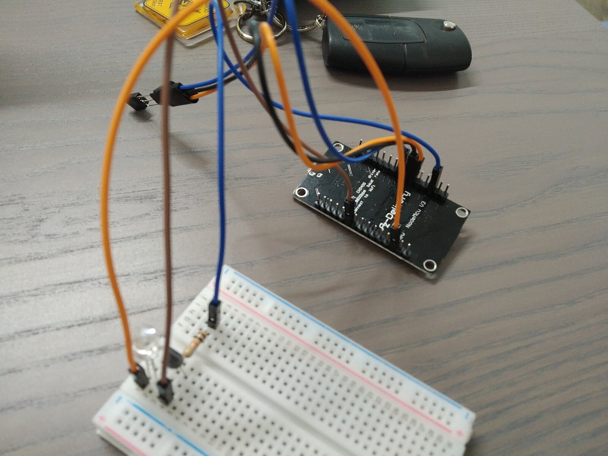
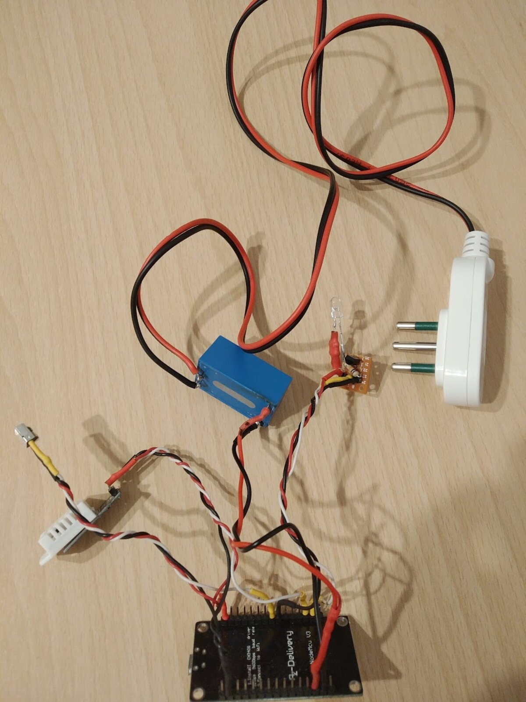
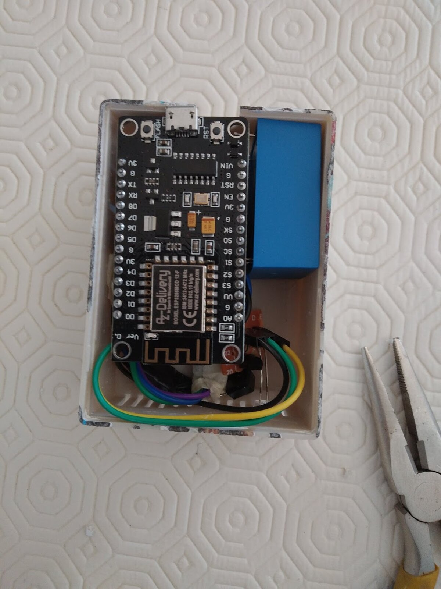
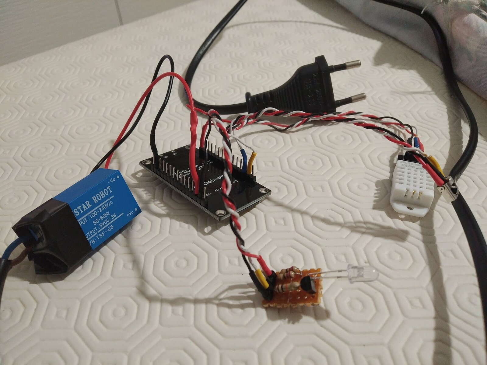
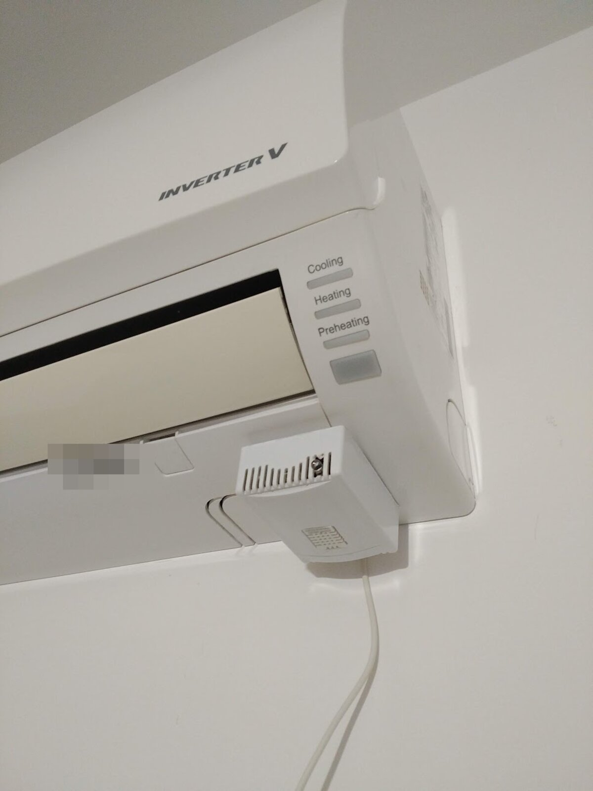

The air conditioner at home is controlled by its remote, and by nothing else. It has no network socket, it talks to nothing, and if the remote is in the other room you get up.

The little boxes you can buy to solve this have been around for years: they fire infrared on your behalf and you drive them from an app. The thing is, that app talks to the manufacturer's server, so the command to switch on an appliance three metres away takes a trip through a data centre. If that service shuts down, or changes its terms, or is simply out, the air conditioner goes back to being a machine with a remote.

I wanted all of it to stay inside the house. The goal was to get the air conditioner into [Home Assistant](https://www.home-assistant.io/) — the home automation system that holds a household's devices together, running on a machine of mine rather than somebody else's — so I could switch it on, switch it off and, above all, automate it along with everything else. In 2020 I built the thing myself.

## It's a blinking LED, really

There is nothing mysterious inside an infrared remote. It's a diode that emits light beyond the range of the eye, switching it on and off very fast in a pattern, and the air conditioner has a receiver that knows how to read that pattern. Point a phone camera at one and you can see it flicker, because plenty of sensors don't filter it out.

So not much is needed: something that sits on the home network, an infrared LED, and a component to drive it — a microcontroller pin can't supply the current an LED needs to be seen a few metres away. I used a transistor, with a resistor to limit the current.

Then there's the part few people think about: a **receiver**. A transmitter on its own works, but it works blind. It fires the command and doesn't know whether it arrived; more to the point, it knows nothing about what happens when somebody picks up the real remote and changes the temperature. With a receiver alongside it, the device also listens to the infrared going past, and what happens in the room stops being invisible.

## From breadboard to perfboard

The first step was on a breadboard, with jumper wires: the board, the LED, the transistor, the resistor. The simplest test there is — aim the LED at the split unit and see whether it responds.


_The first version, on a breadboard. Enough to find out whether the air conditioner would answer at all._

Then the same thing soldered onto a scrap of perfboard the size of a stamp, transmitter and receiver on the same little board, with the LED left on its long legs so it can be pointed where it's needed. The board is one of those carrying an ESP8266: the few-euro wifi module that made putting anything at all on a network normal.


_Everything wired together before going into the box: the mains module, the infrared board, the sensor on its lead, and the microcontroller._

It isn't precision work. It's an afternoon with a soldering iron, and it looks like it.

## Power decides the shape of the object

At this point the question stops being electronics and becomes shape: how does this thing sit in a room.

A USB power supply was the short road, and it would have produced the object you see everywhere — a little box with a cable running down to a socket. Instead I put a module inside the box that takes mains voltage and gives back the 5 volts the board needs: two fingers wide, a few euros.


_Inside the box: the board, and next to it the module that brings the mains down to 5 volts._

That choice does mean mains voltage runs inside the enclosure, and the care that calls for is of a different order: insulate properly, leave nothing exposed, close it up. Not a detail to wave through.

The advantage isn't the price, it's that the object becomes self-contained: a closed box with two wires going in and nothing around it. From there you can put it anywhere there's power — which is exactly what made the final arrangement possible.

## The sensor the air conditioner doesn't have

On the same board I added a temperature and humidity sensor, on a lead long enough to place it where it's useful. It wasn't in the original plan, but once you have a networked device attached to the air conditioner, not putting a sensor on it is a waste.


_The sensor is the white grille on the right, deliberately on a long lead so it wouldn't have to sit wherever the rest of the electronics ended up._

There's a practical reason too. The air conditioner measures temperature with its own probe, which sits inside the unit, high up near the ceiling, where the air is warmer than the air people are actually in. That number is fine for the machine's own thermostat, but if you want to trigger something based on how warm *the room* is, you need a reading taken somewhere else.

Then the installation got in the way. With the box ending up inside the air conditioner, a sensor in there measures the machine's air, not the room's. It sits inside, but as far from the motor as it can be, almost looking out. It's a compromise, and it may as well be said plainly: it isn't the same as a sensor standing free in the middle of the room, but it's a far closer reading of the room than the one the split gives.

## Tasmota

I didn't write any firmware for the microcontroller. I put [Tasmota](https://tasmota.github.io/docs/) on it — free firmware born to free smart plugs from the manufacturer's cloud. You install it in place of the factory one, and the device starts speaking MQTT on the home network, with a configuration page and nothing else around it.

It goes on over serial, with a USB adapter wired to the board's pins. First the microcontroller has to be put into programming mode, GPIO0 pulled to ground as the power comes up, and then the memory is written from the command line: erase it, then write the firmware at address zero.

```
esptool.py --port /dev/ttyUSB0 erase_flash
esptool.py --port /dev/ttyUSB0 write_flash -fm dout 0x0 tasmota-ir.bin
```

The filename matters: **tasmota-ir**, not plain Tasmota. A separate build exists because the library that speaks infrared carries an enormous number of protocols — every air conditioner manufacturer has its own — and all of it together doesn't fit alongside the rest of the features. So the project made a build that keeps almost every IR protocol and gives other things up. With standard Tasmota you can't drive the air conditioner at all.

Then you tell the firmware which pin does what: one to send, one to receive, one for the sensor.

Finding the right protocol was the long part. The library knows several LG variants, and nobody tells you which one your appliance speaks: you try one, watch whether the split responds, change it. It took me a good many attempts. In the end it was the one Tasmota calls `LG2`. And this is where the receiver stopped being a luxury: press a button on the real remote, read what Tasmota made of it — protocol, mode, temperature — and hold that up against what you were about to send.

## Where it ended up

For a while the box stayed where it's natural to put it: on the wall under the split, white on white, its cable running down to the socket.


_The intermediate arrangement, and the last one there is a photograph of._

Then I took the last step. There is already power inside the air conditioner, and the module I'd put in the box starts from mains voltage anyway, so it only had to be connected there. The device ended up inside the casing of the indoor unit, powered by the machine it controls, with the LED aimed where it needs to be and the sensor kept as far from the motor as possible. From outside there's nothing to see: there's an air conditioner, exactly as before.

It has been working since 2020. In those years the only thing I've had to go back to is the configuration on the Home Assistant side, which has changed a great deal in the meantime. The hardware, no — that just sits there.

Five years is a long time for something soldered onto a scrap of perfboard in an afternoon. The reason it has held, I think, is that it depends on nothing: it has no account, it calls no server, and the only thing it has to do is light an LED at the right moment.
