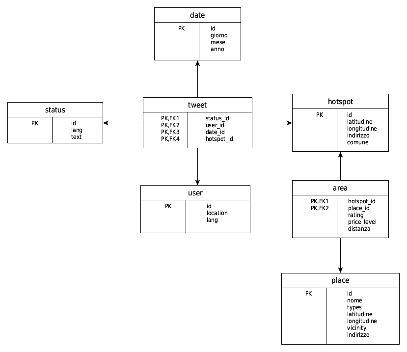

I started a computer science degree in 2009. By the time I got to my thesis in 2012, Big Data was becoming a real word, not just a buzzword yet, and I wanted my thesis to be about actually building one of these systems rather than just reading about them — a data warehouse that pulled together data from different web sources using the emerging Hadoop/Hive stack, instead of a traditional relational database.

## What I actually built

The dataset was geolocated tweets, cross-referenced with nearby points of interest — cafes, banks, bookstores, transit stations — each with its own category, rating and price level. The connecting concept was the "hotspot": a public WiFi access point, with its own coordinates. The core question the model let you ask was things like: how much does a hotspot's neighborhood get talked about, how "urbanized" is it based on how many places surround it, and what's the weighted price level of everything nearby.

_The multidimensional model: tweets as one fact table, hotspot-to-place relationships as another, joined through a shared hotspot dimension._

Computing "how close is this hotspot to that place" meant calculating real-world distance from latitude/longitude pairs, so I wrote a small Java UDF — a Haversine distance function — and loaded it straight into Hive as a custom SQL function. It's still sitting in a public repo, still compiles, still does exactly what it did in 2012.

## The experiment

Building the warehouse in Hive wasn't the actual thesis question. The real question was whether it was worth it — so I built the identical data warehouse a second time, in plain MySQL, and benchmarked both against a real sample: about 103,000 records across tweets, places, hotspots and users. Three things got measured: storage size, import time, and query response time.

Two of the three results were exactly what you'd expect from the pitch. Hive's storage came out smaller — about 8MB against MySQL's 13.5MB for the same data — because a schema-less format doesn't waste space on padding or null columns the way a rigid relational schema does. Import time wasn't close: Hive loaded the entire dataset in just over 2 seconds, MySQL took over 5 minutes, because Hive is essentially writing files while MySQL is doing per-row inserts with constraint checking.

Then came the query benchmarks, and the results weren't what the pitch promised. On two of the four analytical queries — the ones combining a join with heavier aggregation and sorting — Hive was actually *slower* than plain MySQL, not faster.

## Why, and why it mattered more than the speedup did

The honest explanation, which is also the more useful lesson: the whole benchmark ran on a single machine. Hadoop and Hive are built to win by spreading work across many nodes in parallel — take that away, and you're left with the translation overhead of turning a query into a MapReduce job, with none of the payoff. On top of that, 103,000 records simply isn't big data. MySQL is built to be fast at exactly that scale, and at that scale it held its own.

I didn't design the experiment to prove Hive right — I designed it to find out, and the answer was "it depends on scale, and only actually measuring it tells you." That's a duller conclusion than "the new thing wins," and a much more useful one. It's the first time a project taught me not to trust a technology's reputation over an actual benchmark, on my own data, at my own scale — a habit that's saved me more than once since.

The thesis got a 106/110. The UDF is still on GitHub.
