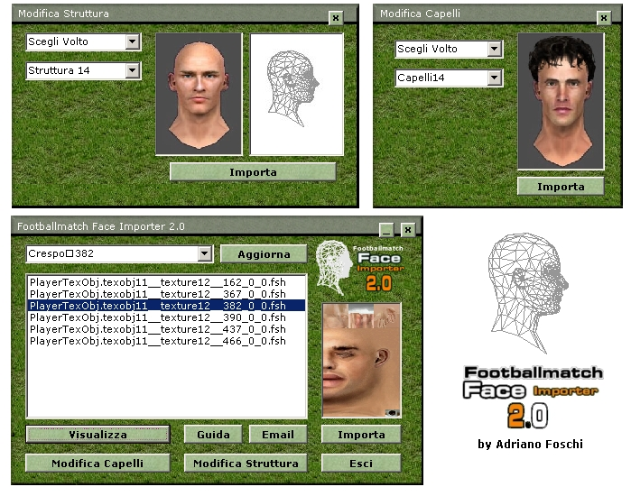
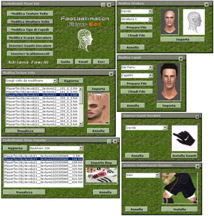
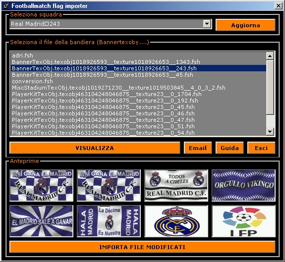
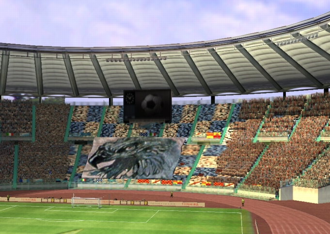

I started writing software at 14, in 2001, to change a football video game. Not in a computer science classroom — in Microsoft FrontPage, on a modding site I ran with a group of teenagers who had never met in person, shipping Windows installers that let strangers replace the faces, kits and boots in their copy of FIFA. This is where the whole thing started, and I'd rather begin at the actual beginning than at a résumé bullet point.

## The world before GitHub

If you're in your twenties reading this, it's worth pausing on how different the landscape was. There was no GitHub, no npm, no Stack Overflow to speak of. If you wanted software, you either bought it in a box or you found it — poorly documented, distributed as a .zip on someone's personal page — through a web ring of enthusiast sites that linked to each other because search engines were still catching up. "Webmaster" was a real job title people put on a personal site's credits page, and it usually meant one teenager with an FTP client and more patience than sense.

Building a website meant Microsoft FrontPage, WYSIWYG tables nested inside tables, and a free hosting account from whichever Italian community would give you one. That's exactly how footballmatch.it started in 2001: a site my father and I put together, in FrontPage, hosted for free on an Italian web community before we ever pointed our own domain at it. It ran until 2005.

## Never much of a player

Here's the part that tends to surprise people: I was never really a player. I didn't get much out of just sitting down and playing FIFA or Pro Evolution Soccer for hours like most of my friends did. What hooked me was everything underneath the game — making it match reality: real squads, real kits, real transfers, eventually real stadiums and even the real sound of a stadium crowd. At the time that meant digging into the game's proprietary file formats by hand, one texture and one player record at a time.

That got tedious fast, so I did what any 14-year-old with too much time and a copy of Visual Basic would do: I started building tools. Not as an end in themselves — because faces, kits, boots and flags all had to be produced at scale for the patches we were actually releasing, and redoing each one by hand in a hex editor didn't scale. A few of the tools that came out of that:

- **Footballmatch Face Importer 2.0** — imported custom player face textures into the game's `.fsh` texture format, with a live 3D preview of the face and hair mesh before importing.
- **Footballmatch Player Edit** — a fuller editor: face textures, hairstyles, boots, gloves, even shin guards, all through a proper Windows GUI instead of a hex editor.
- **Footballmatch Flags Importer** — swapped team badges and banners, with thumbnail previews of every asset before you committed to importing it.
- **Footballmatch Shoes Importer** — the same idea, scoped to boot textures.

_Footballmatch Face Importer 2.0 — the preview is the whole point: see the head before writing it into the game's texture archive._

There were others besides these. But none of them were really the product — they were the assembly line. The actual product was the patch: a complete, installable bundle of updated squads, kits, boots, flags, faces and eventually stadiums that turned a stale FIFA install into something close to the current season. Build the tools, use them to produce assets at volume, bundle everything into one patch, do it again for the next transfer window. Looking back, that's the part that mattered most: not any single tool, but the pipeline behind it — and the willingness to build the tool instead of doing the tedious part by hand every time.

_Footballmatch Player Edit — face, hair, boots, gloves and shin guards, all through dropdowns instead of a hex editor._

## A distributed team before I knew that word

footballmatch.it was never a solo project. Beyond my father and me, the credits page listed a handful of other teenagers scattered across Italy, plus one adult in his thirties, none of whom I'd ever met face to face. Everyone owned a slice: someone did kits, someone did stadium graphics, someone did advertising boards. We coordinated over forums and email, with no version control, no CI, and no shared understanding of the word "release" beyond "we're all done, let's zip it."

And yet the output looked exactly like a release: the **FIFA Footballmatch 2003 Superpatch** bundled the full Serie A 2002-03 squad update, home and away kits for every team, flags, a new ball, a re-skinned in-game menu with custom cursor, updated league badges, transfers current to the end of August, and stadium chants — actual crowd and ultras recordings, captured and audio-edited in by hand so the stadium sounded alive instead of generic. Every contributor got credited by name for their piece. Nobody called it a changelog, but that's what it was.

_Flags Importer — swap a team's badges and banners with a preview, no manual file editing required._

footballmatch.it also wasn't an island. It linked out to, and was linked back by, a small constellation of sister sites — fifamania.it, fifaonline.it, fifaseriec.it, soccergames.it, even a German and a Greek site doing the exact same thing for their own communities. Nobody involved would have called it open source, but functionally that's exactly what it was: distributed, credited, cross-linked contribution to a shared, unofficial product.

## Into the third dimension

Textures and player data were one layer. Stadiums were a different problem entirely, and a much harder one: EA shipped them protected, so for years the entire Italian modding scene could only re-skin a stadium's existing textures, never touch its actual 3D structure. Giorgio Lunardon, working through fifamania.it with Riccardo De Conciliis and help from Massimo Bambi, was the one who cracked that protection open for FIFA 99/2000 — the first time anyone could rebuild a stadium's geometry from scratch instead of just repainting it. San Siro, Delle Alpi, the Olimpico, a Maracanã someone else built for fifaonline.it (whose site was run by Federico "Leo" Leonardo) — a whole generation of Italian stadiums existed in FIFA because of that work.

I picked that baton up a few years later. Using Rhino 3D, I took Lunardon's original models and ported them forward across several FIFA releases that came out after the version they were built for — converting geometry and re-mapping textures release after release so the same stadium kept working as EA's file formats shifted underneath it. I also built some stadiums entirely from scratch, my own models, start to finish.

_The Olimpico, Lazio version — one of the stadium models that started with Lunardon's original work and kept getting ported forward as FIFA moved on._

The same instinct carried over to Pro Evolution Soccer 3, 4 and 5, working with a different set of collaborators there — one of the better-known ones went by Forzaroma, who was still building stadium mods for PES more than a decade later.

By the time a Superpatch actually shipped, the work behind it spanned four completely different disciplines: 2D texture work for kits, flags and faces; 3D modeling for stadiums; audio editing for crowd and chant recordings; and, underneath all of it, purely technical programming — the importer tools that turned every one of those assets into something the game would actually load. Whatever the patch needed next was whatever I learned to do next.

## Seeing it reach further than I expected

At some point, the superpatch made it onto the cover disc of *Giochi per il Mio Computer* — one of the best-known Italian PC gaming magazines of the era. Seeing something I'd built as a 14-year-old land in front of a magazine's entire newsstand audience, instead of just the handful of forums I frequented, was the first time the hobby felt like it might be more than a hobby.

## Where it led

I'm not going to pretend a 14-year-old building a face importer in Visual Basic had any idea what he was doing career-wise. He didn't. But that hobby is the reason I ended up studying computer science, and then spending the next twenty years building software professionally — freelance work, a decade in consulting, and now leading engineering as a CTO. This blog is going to follow that whole arc, one project at a time: what I built, why, and what came of it. This post is just where it starts.
