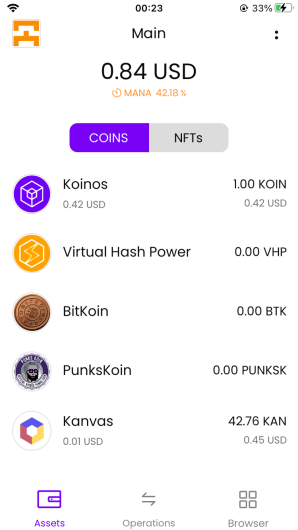
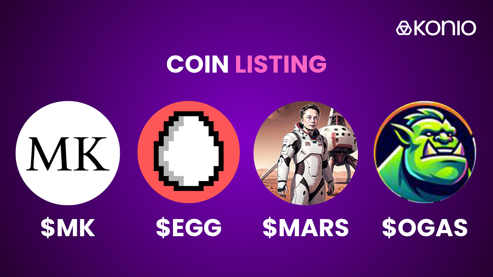
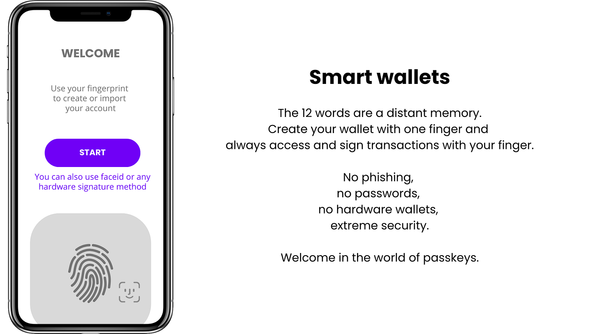

By the autumn of 2023 I had a mobile wallet in production. Konio was a native iOS and Android wallet for [Koinos](https://koinos.io/), a blockchain with no transaction fees, and I had written it alone: create or import a wallet from a seed phrase, hold tokens and NFTs, sign for dApps over WalletConnect, in eleven languages.

It worked. The data model underneath it did not, and the next six months were spent on three things: fixing that, making the app comprehensible, and getting people to use it.

## The data model I had shipped was wrong

Version one stored everything in two blobs. One JSON object in ordinary device storage held settings, accounts, coins and the address book; one encrypted object in the OS keystore held the keys and the password. Accounts carried an array of token contract ids, and those tokens lived in a separate map keyed by contract id alone.

That last detail is the bug in the shape of the data. A token is not a global thing — the same contract means a different balance for each account, on each network. Keying by contract id alone meant those couldn't coexist as distinct records. Every feature I wanted next, starting with proper multi-network support, ran into it.

So in October 2023 I normalized it: five separate stores — settings, accounts, secrets, coins, contacts — with every entity carrying an explicit id, and composite keys where an entity is genuinely defined by a combination. A coin's identity became account plus network plus contract, which is what it had been all along in reality.

## Doing that without a server

That is an ordinary refactor in any app with a backend. You migrate the database, you have backups, and if it goes wrong you restore.

Here there was no backend, no backup, and no undo. The only copy of a user's data was on their phone, and part of that data was the keys to their money. A migration that half-succeeded wouldn't produce a support ticket, it would produce a person locked out of their own funds — permanently, because there's no password reset for a blockchain account.

Four decisions made it survivable, and I'd reuse all of them:

**Migrations are dated, ordered, and individually committed.** Each one is a function keyed by a date — `20231003`, `20231004`, and so on — sorted and applied in sequence, with the stored version bumped only after a migration returns successfully. A failure halfway through the chain leaves the version at the last step that actually worked, so the next attempt resumes at exactly the right place instead of replaying work that already happened.

**Failure is loud and blocking.** A dedicated screen gates the app when a migration is pending, and if one throws it shows the real error text rather than a friendly message. That looks unpolished. It's the right call: the alternative is an app that carries on with half-converted data and lets the user act on it.

**The old data is deleted one version later, not in the same step.** The migration that reads the v1 blobs doesn't remove them. A separate, subsequent migration does. For one release the original data sat there untouched as a fallback — cheap insurance, paid for in a few kilobytes.

**Small, boring migrations are fine.** Five shipped between October 2023 and February 2024. One re-encoded every stored NFT token id to hex. Two just corrected a default value. Keeping them tiny is what made each one easy to reason about, and reasoning about them was the whole job.

## Making the app explain itself

The interface got restructured over the same period. The bottom navigation went from three unlabelled icons to named destinations — Assets, Operations, Browser. Coins and NFTs became an explicit toggle instead of one merged list.

_The redesigned main screen. The orange figure under the balance is mana._

The change I care about most is that small orange percentage. Mana is what makes transactions on Koinos free: it's a resource tied to the tokens you hold, spent when you transact and regenerated over time. Users had no existing mental model for it, and the temptation was to hide it — free means the user shouldn't have to think about it. Hiding it is worse. A person whose transaction fails because mana ran low, with nothing on screen having warned them, concludes the app is broken. Showing "42%" and letting them tap through to a fuller explanation treats a real constraint as a real constraint.

## Letting the ecosystem add itself

Three of the repositories were not code. [`konio-tokenlist`](https://github.com/konio-io/konio-tokenlist), [`konio-dapplist`](https://github.com/konio-io/konio-dapplist) and [`konio-collectionlist`](https://github.com/konio-io/konio-collectionlist) are folders of small JSON files, one per token, dApp or NFT collection, and anyone could add theirs with a pull request. A token entry is a contract id, a symbol, a logo, and a price endpoint plus the path to read the number out of the response. A dApp entry is a name, a summary, tags, a URL and an icon.

_A listing announcement from January 2024. Each of these arrived as a pull request against a folder of JSON files._

This was self-defence as much as openness. I was one person. Curating an in-app catalogue by hand is an unbounded second job that grows exactly as fast as the thing succeeds; reviewing a ten-line JSON pull request takes two minutes. It also meant a project didn't need my attention to appear in the wallet — they needed a text file. By January 2024 the app shipped with those lists prefilled, plus push notifications and a discovery feed that read the project's own posts.

## The giveaway

In November 2023 I ran an onboarding campaign, and I ran it myself — the code and the marketing were the same person.

It was [announced on 12 November](https://medium.com/@konio_io/announcing-a-koinos-onboarding-giveaway-ec528542d532) and ran from the 21st to the 27th, hosted on [Zealy](https://zealy.io/), where participants complete small tasks to earn entries. The prize pool was over $3,000: a 48-piece NFT collection I wrote a smart contract for, KOIN, tokens contributed by partner projects, and [KAP](https://kap.domains/) name vouchers. Twelve projects from the Koinos ecosystem put prizes in. Influencers carried it to a few hundred thousand social followers.

On 20 December the wallet [passed 2,000 active users](https://medium.com/@konio_io/konio-has-more-than-2000-active-users-a6356b90ac22).

I'll be honest about what that number is and isn't. A giveaway measures reach, not retention — a meaningful share of those installs were there for the prize pool and behaved accordingly. What it did do, beyond the wallet, was pull twelve separate projects into a single coordinated push and give a small ecosystem a week of momentum it wouldn't otherwise have had. That part I'd count as the real result.

## The thing I couldn't fix from inside the app

Then I ran into a wall that no amount of interface work would get past.

Everything I had built — biometric unlock, autolock, a clear send flow, an address book — protects the phone. None of it protects the account, because on a conventional blockchain the account *is* a key pair, and the key pair is those twelve words. There is no recovery. There are no permissions: an account can either do everything or nothing. No spending limit, no second approver, no way to let a person try the thing before making them responsible for a secret they cannot ever lose.

I had spent months polishing an experience that still ended, for every new user, at "write these words down and don't lose them, forever."

_From the direction I published in February 2024. A statement of intent, not a shipped screen — the app never got there._

In March 2024 I started rebuilding the wallet around [passkeys](https://passkeys.dev/), and got just far enough to understand that I was solving it at the wrong layer. Making the phone's biometric hardware hold a key is still one key, one account, no recovery. The fix has to be in the account itself — the account becoming a programmable contract that decides what a valid signature is and what an operation is permitted to do. [Smart accounts](https://eips.ethereum.org/EIPS/eip-4337), in other words. Not an app feature; a protocol feature that didn't exist on Koinos.

Konio's last release was February 2024. It was eventually deprecated in favour of a successor built on exactly that idea, and then the crypto market receded and took a lot of the Koinos ecosystem with it, so both are dormant today. [The source](https://github.com/konio-io/konio-mobile) is still public under GPL-3.0.

What I took from it isn't the user count. It's the habit of asking, earlier, whether the problem I'm polishing actually lives at the layer I'm working on. The migration discipline and the community-fed lists were right, and I still use both. The wallet was only ever going to be as good as the account model underneath it, and that took me six months to see.
