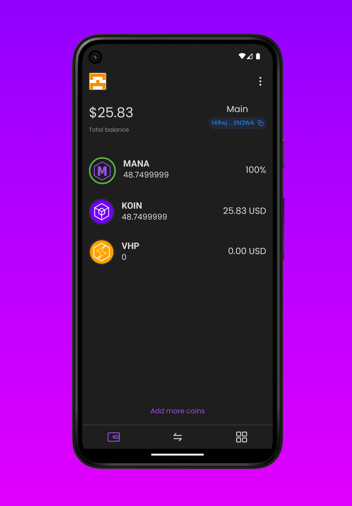

I was drawn to web3, and I was looking for a blockchain that would let me build with the mindset and tools of a web2 developer — smart contracts in AssemblyScript, close to TypeScript, REST APIs instead of the usual opaque RPC endpoints. [Koinos](https://koinos.io/) stood out for the rest of it too: no ICO, no pre-mine, a Proof-of-Burn consensus designed to combine proof-of-stake efficiency with proof-of-work economics, and on-chain governance that upgrades the protocol by vote instead of by hard fork. But what actually convinced me was that the developer experience looked like ordinary web development.

Smart contracts were written in [AssemblyScript](https://www.assemblyscript.org/), a subset of TypeScript, through an [SDK](https://github.com/koinos/koinos-sdk-as) that compiled them to WebAssembly. The node exposed [REST APIs](https://docs.koinos.io/), and there was [`koilib`](https://github.com/joticajulian/koilib), a JavaScript library that behaved like any other SDK you'd pull off npm — a genuinely good one, with APIs for pretty much anything I needed. I didn't have to earn the right to write the first line of code by learning a new language and a new mental model first: everything I already knew from years of web work transferred directly. I'd never worked with React Native before, and this was a good excuse to get into it — there was a learning curve, but the path was clear.

Once I joined the community — small, but already a few years old — I noticed something I hadn't expected: Koinos had been around for a while, and yet there was no way to use it from a phone. Just browser extensions. Nothing native on mobile. It was a well-shaped gap: the problem was obvious, the scope was finite, and I'd find out quickly whether I could actually pull it off.

## What Konio is: a native wallet for iOS and Android

I started writing Konio on 22 June, and by autumn it was already on both app stores: a native wallet for iOS and Android, built with [React Native](https://reactnative.dev/) and [Expo](https://expo.dev/), using `koilib` to talk to the chain.

The feature list was what you'd expect. Create or import a wallet from a seed phrase, then derive additional named accounts from that same seed so there was only one thing to keep safe. Biometric unlock and an autolock timer. Send and receive tokens and NFTs, with an address book so I wasn't pasting base58 strings by hand. [WalletConnect](https://walletconnect.network/), so the wallet could sign for dApps — including scanning a QR code from a desktop browser. An in-app browser for dApps. Multiple networks. Eleven languages, because the Koinos community was scattered across a lot of countries and none of them were mine.

_The main screen. Mana is the resource that makes transactions free on Koinos, so it gets a row of its own next to the balances._

_Sending tokens. Most of the work in a wallet is in the ordinary screens, not the cryptography._

That summer Koinos ran a hackathon, the Supercharger, from 10 July to 7 September. I entered Konio and won. It's a small ecosystem and I want to be honest about the scale of that — but it was enough to settle whether the gap I'd picked was real or just something I'd talked myself into.

The cryptography, honestly, was the easy part. `koilib` signed the transactions; I didn't need to invent anything. The hard part was somewhere else, somewhere I didn't expect.

## The hard part was state

A wallet had no server. There was no backend holding the truth, no account to restore from, no "log in on your new phone and everything comes back." Whatever the app knew lived on that device and nowhere else, and a meaningful slice of it — private keys, the password — could never leave the operating system's secure storage. Get the state layer wrong and you didn't get a bug report, you got somebody who couldn't reach their money.

On top of that, everything in a wallet was connected to everything else. Forty-one screens all read and wrote the same handful of entities: accounts, coins, networks, contacts, NFTs, transactions, WalletConnect sessions, mana balances. Adding an account had to create the default coin entries for every configured network. Switching network had to change what half the app was showing.

For state I used [Hookstate](https://hookstate.js.org/) — a little-known library, but a very capable one if you use it with care, lighter and more adaptable than alternatives like Zustand. The persistence layer, though, I wrote by hand.

I built it around an adapter: every store saved and reloaded its data through a common interface, but the backend behind that interface changed depending on what it had to hold. Ordinary data went through the phone's normal storage; private keys and the password went through the operating system's encrypted keystore instead — the same mechanism that protects system passwords, not something I built myself. The code that read and wrote the two kinds of data was identical; only the adapter handed to it changed. So the difference between "ordinary data" and "data that needs protecting" wasn't a rule scattered through the code, it was the choice of a single adapter.

The other piece was hydration: on app launch, state started out empty, and data got reloaded from disk asynchronously — that took a moment. In that moment, a balance shown as zero was indistinguishable, to the user, from a balance that was actually zero: it looked exactly like a wallet that had lost their money. To avoid that, every store explicitly flagged when it had finished reloading, and screens waited on that flag before showing any number, instead of showing an empty state as if it were already the truth.

Accounts, coins, and networks constantly referred back to each other, and wiring them all directly to one another would have created a tangle of dependencies. Instead, every store registered itself under a name and looked up the others only when needed, rather than depending on them directly.

None of this was exotic. It was the same problem as any offline-first app: the device is the source of truth, persistence is async, and the data model is a graph rather than a list. What sharpened my thinking was the stakes. In most apps, a state bug means a wrong number on a screen and a refresh. Here, the number on the screen was the only record.

## Getting it published was a second project

Writing the wallet took a few months. Getting Apple to accept it took a different kind of stubbornness, and none of it was technical.

The blocking rule sits in the [App Store Review Guidelines](https://developer.apple.com/app-store/review/guidelines/) at 3.1.5(b): an app may offer virtual currency storage only if it comes from a developer enrolled as an organization. An individual developer account can't publish a wallet at all — full stop, regardless of what the app does or how well it does it. So the first hard requirement for shipping this project had nothing to do with software: I needed a legal entity, and I didn't have one. Konio went out under [E-Time](https://www.e-time.it/en/), the software house I was working for at the time, which agreed to act as the publishing entity.

That got me into the queue. The queue was its own education. Crypto apps get treated as guilty until proven otherwise, and the rejections read like they'd been written without anyone actually opening the app: objections to behavior that wasn't there, points I'd already fixed and explained in the previous submission coming back verbatim, replies that didn't engage with the answer I'd already given. Every round cost days, and none of those days made the app any better.

I don't think that scrutiny is unreasonable in principle — a wallet is one of the few categories of app where a malicious build can drain someone's savings, and the store is the only thing standing in front of that. But the process, as I experienced it, filtered on paperwork and pattern-matching rather than on whether the software was any good. A solo developer with no company behind them doesn't get past the first gate, and that has nothing to do with the quality of what they built.

[Konio's source](https://github.com/konio-io/konio-mobile) is on GitHub, under GPL-3.0 — publishing it felt like the right way to close out a project that a hackathon and an App Store review had already put through enough scrutiny. What stays with me, after seven months of writing it, is a habit: treating local state as a system with its own architecture — adapters, hydration, a dependency graph — rather than as a bag of variables the screens happen to share.
