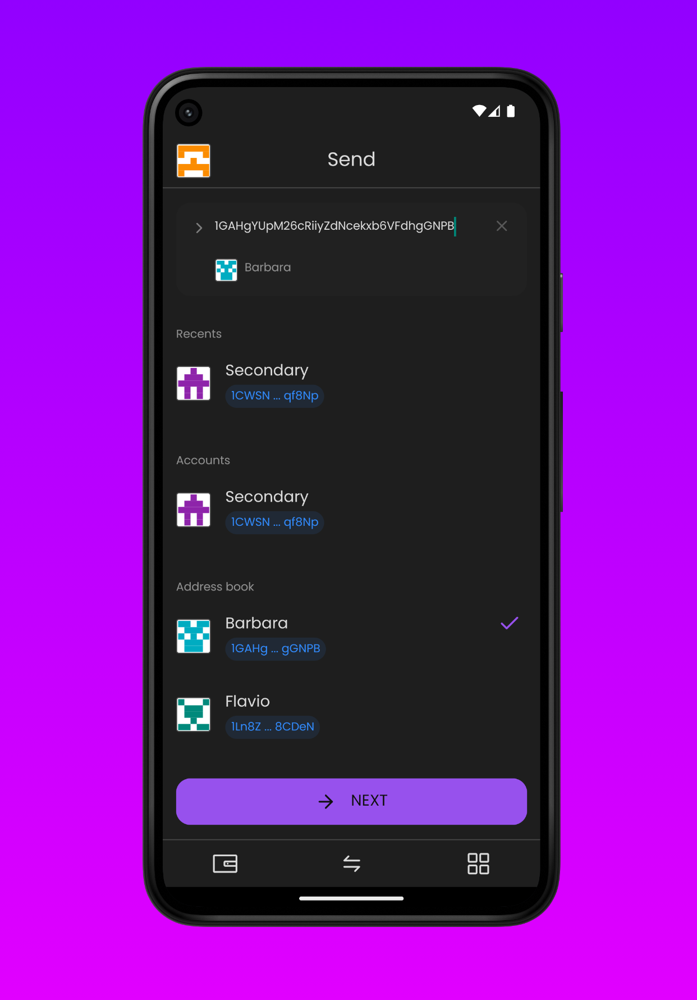

In 2023 I wanted to build something on a blockchain instead of reading about one. What made me stop on [Koinos](https://koinos.io/) wasn't the tokenomics — it was that the developer experience looked like ordinary web development.

Smart contracts are written in [AssemblyScript](https://www.assemblyscript.org/), which is a subset of TypeScript, through an [SDK](https://github.com/koinos/koinos-sdk-as) that compiles them to WebAssembly. The node exposes [REST APIs](https://docs.koinos.io/). There's [`koilib`](https://github.com/joticajulian/koilib), a JavaScript library that behaves like any other SDK you'd pull off npm. I didn't have to earn the right to write the first line of code by learning a new language and a new mental model first. Everything I already knew from years of web work transferred directly.

The second thing was the fee model. Koinos doesn't charge gas; it uses ["mana"](https://koinos.io/whitepaper), a regenerating resource tied to the tokens you hold, so transactions are free at the point of use. Better still, a contract can declare who pays the mana for a call — which means a person holding exactly zero tokens can still do something on-chain. Anyone who has tried to onboard a normal human onto a blockchain knows that "first go buy some of this other token to pay the fees" is where most of them stop.

What Koinos didn't have was a way to use it from a phone. There were browser extensions. On mobile, nothing native. That's a well-shaped gap: the problem is obvious, the scope is finite, and you find out quickly whether you can actually ship.

## What I built

I started Konio on 22 June 2023 and had it on both app stores by the autumn: a native wallet for iOS and Android, built with [React Native](https://reactnative.dev/) and [Expo](https://expo.dev/), using `koilib` to talk to the chain.

The feature list is what you'd expect. Create or import a wallet from a seed phrase, then derive additional named accounts from that same seed so you only ever have one thing to back up. Biometric unlock and an autolock timer. Send and receive tokens and NFTs, with an address book so you're not pasting base58 strings by hand. [WalletConnect](https://walletconnect.network/), so the wallet could sign for dApps — including scanning a QR code from a desktop browser. An in-app browser for dApps. Multiple networks. Eleven languages, because the Koinos community was scattered across a lot of countries and none of them were mine.

_Sending tokens. Most of the work in a wallet is in the ordinary screens, not the cryptography._

That summer Koinos ran a hackathon, the Supercharger, from 10 July to 7 September 2023. I entered Konio and it took first place. It's a small ecosystem and I want to be honest about the scale of that — but it did settle the question of whether the gap I'd picked was a real one or just one I'd talked myself into.

The cryptography, honestly, was the easy part. `koilib` signs transactions; I didn't need to invent anything. The hard part was somewhere I didn't expect.

## The hard part was state

A wallet has no server. There's no backend holding the truth, no account to restore from, no "log in on your new phone and everything comes back". Whatever the app knows lives on that device and nowhere else, and a meaningful slice of it — private keys, the password — must never leave the operating system's secure storage. Get the state layer wrong and you don't get a bug report, you get somebody who can't reach their money.

On top of that, everything in a wallet is connected to everything else. Forty-one screens all read and write the same handful of entities: accounts, coins, networks, contacts, NFTs, transactions, WalletConnect sessions, mana balances. Adding an account has to create the default coin entries for every configured network. Switching network has to change what half the app is showing.

I used [Hookstate](https://hookstate.js.org/) for the state itself, but wrote the persistence layer by hand, and three decisions there did most of the work.

**The storage engine is a parameter, not an assumption.** I wrote a small extension — `localstored` — that persists a store to disk and hydrates it on startup, with the actual storage backend passed in as an argument. Ordinary data goes to [AsyncStorage](https://github.com/react-native-async-storage/async-storage). Secrets go to [`expo-secure-store`](https://docs.expo.dev/versions/latest/sdk/securestore/), which is the OS keystore. The two stores are written identically; the only difference is the engine handed to them. That kept "this data is sensitive" a single visible line at the top of a file, instead of a rule I had to remember in every place that touched a key.

**Hydration is asynchronous, and the UI has to know.** Reading from disk takes time, so for a moment after launch the state is empty and technically correct — and a wallet that renders a `0.00` balance before it has finished loading looks exactly like a wallet that has lost your money. Each store publishes a "loaded" flag into a shared registry, and the screens wait on the flags for the stores they depend on rather than rendering an empty truth.

**Stores look each other up by name.** Because adding an account touches coins and networks, and those stores refer back to accounts, importing them into each other directly gets circular fast. Instead every store registers itself in a registry under a name and resolves the others at call time. It's a small indirection that stops the dependency graph from turning into a knot.

None of this is exotic. It's the same problem as any offline-first app: the device is the source of truth, persistence is async, and the data model is a graph rather than a list. What made it sharpen my thinking was the stakes. In most apps, a state bug means a wrong number on a screen and a refresh. Here, the number on the screen *was* the only record.

## Getting it published was a second project

Writing the wallet took a few months. Getting Apple to accept it took a different kind of stubbornness, and none of it was technical.

The blocking rule sits in the [App Store Review Guidelines](https://developer.apple.com/app-store/review/guidelines/) at 3.1.5(b): an app may offer virtual currency storage only if it comes from a developer enrolled as an organization. An individual developer account cannot publish a wallet at all — regardless of what the app does or how well it does it. So the first hard requirement for shipping this side project had nothing to do with software: I needed a legal entity, and I didn't have one. Konio went out under [E-Time](https://www.e-time.it/en/), the software house I was working for at the time, which agreed to act as the publishing entity.

That got me to the queue. The queue was its own education. Crypto apps are treated as guilty until proven otherwise, and the rejections read like they'd been written without anyone opening the app: objections to behaviour that wasn't in there, points I had already fixed and explained in the previous submission coming back verbatim, replies that didn't engage with the answer I'd given. Every round cost days, and none of those days made the app any better.

I don't think that scrutiny is unreasonable in principle — a wallet is one of the few categories of app where a malicious build can drain someone's savings, and the store is the only thing standing in front of that. But the process, as I experienced it, filtered on paperwork and pattern-matching rather than on whether the software was any good. A solo developer without a company behind them doesn't get past the first gate, and that has nothing to do with the quality of what they built.

[Konio's source](https://github.com/konio-io/konio-mobile) is still public, under GPL-3.0. The app itself is no longer distributed. What I kept from it is the habit of treating local state as a system with its own architecture — engines, hydration, a dependency graph — rather than as a bag of variables the screens happen to share.
