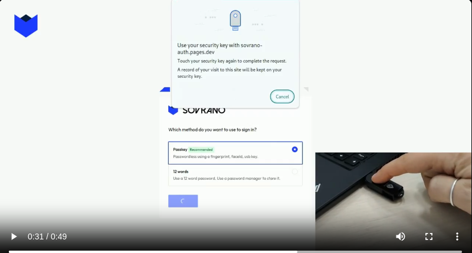

Self-custody is presented as freedom, and it is, but the fine print is that you become your own bank's entire security department. Write down twelve words. Store them somewhere a fire won't reach and a guest won't find. Never type them into anything. Lose them and your money is gone, with no one to appeal to.

Then, before you can do anything at all, install a browser extension, and acquire some of the network's token to pay fees with — using, presumably, the wallet you don't have yet.

From 2024 to 2025 I built Sovrano to find out how much of that could simply be deleted.

## What it is

Sovrano is a self-custody wallet on [Koinos](https://koinos.io/), a blockchain with no transaction fees. It's built on [Veive](https://github.com/veive-io), a modular smart-account protocol I'd written for the same chain, where an account isn't a key pair but a contract, and its behaviour — how a signature is checked, what an operation is allowed to do — comes from modules installed into it.

That's the load-bearing choice. If the account is a contract that decides for itself what counts as a valid signature, then "sign in with your fingerprint" isn't a convenience layer bolted onto a key. It's the account's actual authentication rule, enforced on chain.

So sign-up looks like this:

_Sign-up. Note the last line: the seed phrase survives as a discouraged fallback, not the default._

A passkey, an account you already have, or — if you insist — twelve words. Inverting that default was the entire point. No download, no extension, no tokens required to start, and nothing to write on paper.

## Making "sign in with Discord" into a signature

Passkeys were the straightforward half: [WebAuthn](https://www.w3.org/TR/webauthn-2/) produces a signature, the account contract verifies it, done.

_A frame from a demo: the browser's own WebAuthn prompt, and a hardware key standing in for the fingerprint._

Social login was the awkward half. [OpenID Connect](https://openid.net/developers/how-connect-works/) providers issue a signed ID token, and a contract can verify that token's signature and read its claims — that part works. But plenty of the accounts people actually have aren't OpenID providers. X, Discord and Telegram authenticate you perfectly well and then hand you something that is not an ID token.

So I wrote an identity broker: a small [Passport](https://www.passportjs.org/) service that speaks each provider's own dialect — OAuth for Google, whatever Discord and X and Telegram want — normalizes the result into a subject like `google|1234`, and mints an RS256-signed ID token of its own, published with a JWK so anything can verify it. Downstream, every provider looks identical: one token shape, one signature algorithm, one public key. The on-chain module doesn't need to know which one you used.

I want to be straight about the cost of that. The broker signs those tokens, so the broker is a trusted issuer, and whoever holds its private key can mint an identity for anyone. In a wallet whose whole premise is self-custody, that's a real centralization point sitting next to the front door. The honest framing is that it was a deliberate trade — reach now, decentralize the issuer later — and "later" is doing a lot of work in that sentence.

## No extension: authentication by redirect

If a wallet isn't a browser extension, applications need some other way to reach it. Sovrano's answer was the pattern the web already settled on twenty years ago: redirects.

The SDK gives an application three moves. **Signup** sends a new user off to create an account and returns with their address and nickname. **Connector** is log-in: the application gets back who it's now talking to. **Authorizer** hands over an unsigned transaction, the user reviews and approves it on Sovrano, and it comes back signed for the application to broadcast.

Anyone who has integrated OAuth will recognise every step, which was the goal — an application supporting Sovrano writes the same code it already writes to support signing in with Google.

Underneath, an approved action is two operations in one transaction: a pre-authorization that records exactly what was approved — contract, method, arguments — and the execution itself, which only goes through if it matches. Approve once, spend once.

## The unglamorous part: saying what you're signing

A blockchain operation is a contract address, an entry point, and a blob of encoded arguments. Asking someone to approve *that* is not consent, it's a formality with extra steps.

So the wallet backend carries a resolver per operation type it understands. The transfer resolver pulls the token's metadata, formats the amount with the right decimals, and looks up the sender and recipient nicknames, so the screen can say "5 KOIN to @someone" instead of rendering base58. Others cover installing and uninstalling modules, registering and revoking a passkey, registering and revoking an OpenID identity, and specific actions from the applications built on it.

And then there's the default resolver, for operations nothing recognises. That fallback is the honest bit: a wallet cannot decode a contract it has never heard of, and the right response is to say so plainly rather than dress an unknown call up in reassuring language.

The rest of the app follows from having nicknames: pay `@someone`, request money from `@someone`, a list of activity, somewhere to put idle funds. Ordinary shapes, which was the ambition.

## Where it ended

The last code went in around September 2025. The site and the domain are gone — the DNS lapsed. Koinos followed the wider crypto market down, the ecosystem around it thinned out, and a wallet is worth precisely as much as the economy it's a wallet for. Nobody was waiting for this one.

What I'd still defend is the premise. Every barrier I set out to remove came off: account creation is a fingerprint or an account you already have, transactions cost nothing, there's no extension, and the seed phrase is a legacy option you have to go looking for. None of that required weakening self-custody, because the account itself was programmable enough to hold the rules.

The part I got wrong wasn't the design, it was the assumption underneath it — that removing friction is what creates demand. It isn't. Friction stops people who already want the thing. I built a very good door into a building nobody was trying to enter.
