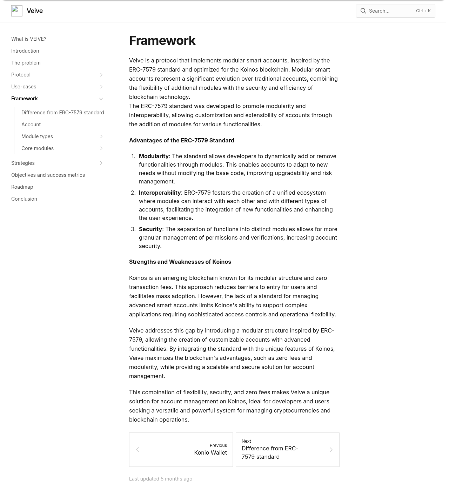

On most blockchains, an account is a key pair. Not a record, not an object with rules — a public key you can be paid at, and a private key that can do absolutely anything with what's there.

Almost every complaint about using a blockchain follows from that one fact. There is no recovery, because there is nothing to recover to: lose the key and the account is gone, and no one can help you. There are no permissions, because a key has nothing to reason with — an account can either do everything or nothing. No spending limit, no second approver, no letting an application move exactly one token and nothing else. And onboarding always terminates in the same instruction: write down these twelve words, keep them forever, tell no one. All of these are symptoms of the same cause: there's no account capable of running its own logic — not just signing or refusing, but reacting, automating, doing things on its own behalf.

Ethereum's answer is account abstraction: make the account a smart contract, so it can decide for itself what a valid signature is and what an operation is allowed to do. [ERC-4337](https://eips.ethereum.org/EIPS/eip-4337) established the pattern, and [ERC-7579](https://eips.ethereum.org/EIPS/eip-7579) standardized *modular* smart accounts — accounts you extend by installing modules.

Koinos, a blockchain with no transaction fees, had no account abstraction at all. I set out to build it, and called it [Veive](https://github.com/veive-io).

## An account made of parts

A Veive account is a contract that does very little by itself. It's a container. Behaviour arrives as [modules](https://veive-io.github.io/framework/module-types/) you install into it, and there are four kinds:

- **[Validation modules](https://veive-io.github.io/framework/module-types/validation-modules/)** decide whether an operation is authorized. This is policy: a valid signature, multiple approvers, a pre-authorized allowance.
- **[Execution modules](https://veive-io.github.io/framework/module-types/execution-modules/)** carry an operation out — and, because they're just code, they can do more than the operation literally asked for.
- **[Sign modules](https://veive-io.github.io/framework/module-types/sign-modules/)** define *how you prove it's you* — a seed phrase, a passkey, an identity provider.
- **[Hook modules](https://veive-io.github.io/framework/module-types/hooks-modules/)** run before and after an operation. Pre-hooks can check conditions and block; post-hooks can log, notify, or trigger follow-up work.

```d2 title="Sequence diagram of one operation passing through the account: validation, then a pre-hook, then execution, then a post-hook, with the account calling each module in turn"
shape: sequence_diagram

dapp: DApp
account: Account
validation: Validation
pre: Pre-hook
execution: Execution
post: Post-hook

dapp -> account: execute(operation)
account -> validation: validate_operation
validation -> account: valid
account -> pre: pre_check
pre -> account: data
account -> execution: execute
execution -> account: result
account -> post: post_check(data)
post -> account: result
account -> dapp: result
```

_The flow of a single operation through validation, a pre-hook, execution, and a post-hook — the account calls each module type in turn, and every one of them can stop it._

It's tempting to read that list as four flavours of permission check. It isn't. Only the first one is about saying no.

The split I'd defend hardest is the third one. In ERC-7579 the validator both authenticates and authorizes. Separating the *signature method* from the *authorization policy* means they can vary independently: you can move an account from a seed phrase to a fingerprint to a Google login without touching a single rule about what that account is permitted to do. Authentication is a mechanism, policy is a decision, and they change on completely different schedules.

## An operation is a specific thing

ERC-7579 is deliberately vague about what an "operation" is. Veive pins it down: an operation is a `contract_id`, an `entry_point`, and its `args` — this contract, this method, these arguments.

Being concrete there is what makes fine-grained policy expressible at all. "Require multiple signatures for `transfer` on the KOIN contract, and a plain signature for everything else" is only a sentence you can write if the system knows what a call to a specific method of a specific contract *is*.

## The missing chokepoint

The one piece of ERC-4337 I could not copy was its EntryPoint — and not copying it is what made the result stronger.

ERC-4337 routes everything through a singleton EntryPoint contract. Every user operation goes in there, gets validated, and comes out the other side. It's a chokepoint, and chokepoints are convenient: one place to stand and check things.

Koinos has no EntryPoint. Operations reach accounts directly. My first read was that this was a gap I'd have to work around.

What Koinos has instead is a native `authorize` hook: when a call needs an account's authority, the chain asks that account, directly, whether it authorizes it. Veive implements that hook, and the consequence is better than the thing I was copying.

An EntryPoint only sees what passes through the EntryPoint. The chain's own authority mechanism sees *everything* — including operations generated internally by other contracts partway through a transaction. So when a contract, in the middle of doing something you did approve, tries to slip in a token transfer from your account that you didn't, your validation modules are consulted for that too, and it fails. Not because I added a defence against it, but because validation is wired into the layer that actually knows about every call, rather than into a lane that well-behaved traffic agrees to use.

The same hook covers the chain's other authorization types, so an account's policies also govern uploading contract code and applying a transaction — not just calls. And there's one small guard I'm fond of: if the caller asking for authorization *is* the validation module itself, the answer is always no. A module cannot vote itself into power.

## Scopes: picking the right module at the right moment

If an account can hold many modules, something has to decide which one applies to the operation in front of it. Veive resolves that through scopes, at three levels of specificity:

1. `entry_point` **+** `contract_id` — this method on this contract
2. `entry_point` — this method anywhere
3. any operation

Resolution runs most-specific-first, and the rules differ per module type, which is the detail that makes the whole thing behave sensibly:

- **Validators**: the single most specific match wins. Exactly one policy decides, so there's never an ambiguous verdict.
- **Executors and hooks**: everything that matches runs. These compose; a logging hook and a rate-limit hook have no reason to exclude each other.
- **Sign modules**: one, account-wide. Two simultaneous ways to prove identity is two attack surfaces, and the whole point of the account is that identity has a single answer.

Different resolution strategies for different module types sounds like an inconsistency. It's the opposite: a decision must be unambiguous, side effects should accumulate, and identity should be singular. The dispatch matches what each kind of module is actually for.

## What you actually build with it

The reason all of this matters isn't the taxonomy — it's that behaviour people normally expect from a bank lands inside the account, where no application can route around it.

**A piggybank.** An execution module installed in the `transfer` scope that puts a percentage of every outgoing transfer into a savings account. Not a feature of a wallet app, not a service you sign up for: the account does it. Every transfer, from any application, from any device, including ones that have never heard of the module.

**A spending limit.** A pre-hook that inspects the operation before it runs and blocks it if it exceeds a cap. The cap belongs to the account, so it applies to every path into that account rather than to the one interface that bothered to implement it.

**A notification.** A post-hook that fires after significant transfers. Because hooks are scoped like everything else, "significant" can mean one thing for a specific token contract and something else globally.

**A pre-authorized allowance.** [`mod-allowance`](https://veive-io.github.io/framework/core-modules/mod-allowance/) is a validation module that inverts the usual order: you approve an exact operation in advance — contract, method, arguments, transaction — and store it. When the operation later arrives, it's checked against what you approved, and on a match the allowance is *consumed*. Approving something once means it can happen once; a replayed transaction finds nothing left to spend. And since Veive validates internally generated operations too, this covers the calls a contract makes on your behalf partway through doing something else, not just the ones you sent yourself.

**Recovery through guardians.** The same multisig module used for shared ownership also works for recovery: installed in the module install/uninstall scopes, a group of guardians — with a configurable threshold, say two of three — can authorize replacing a lost signing method, like a lost device's WebAuthn key. No external recovery service is needed: it's the same validation mechanism, applied to a different scope.

**Multiple signatures.** A validation module requiring several approvers for operations in a given scope, while everything outside that scope carries on with a single signature.

None of these need the applications to cooperate, and none of them need the account to be rewritten. Install, and the account behaves differently from that block onward.

## Passkeys and Google accounts, verified on chain

The sign modules are where the abstraction stops being theory.

[`mod-sign-webauthn`](https://veive-io.github.io/framework/core-modules/mod-sign-webauthn/) lets an account be controlled by a [WebAuthn](https://www.w3.org/TR/webauthn-2/) credential — a passkey. You register the credential's public key with the account, and from then on a fingerprint or a face signs transactions. No seed phrase exists anywhere.

[`mod-sign-openid`](https://github.com/veive-io/mod-sign-openid-as) goes further: you link an [OpenID Connect](https://openid.net/developers/how-connect-works/) identity — a Google or Microsoft account — and the account verifies the provider's ID token itself. On chain, the contract decodes the JWT, checks it against the provider's public key, and reads the claims to confirm the operation was authorized by that user. A person who has never heard of a blockchain signs in with the account they already have.

Neither of those was possible with what the chain provided. WebAuthn signs with ECDSA over P-256; OpenID ID tokens are signed RS256. Koinos could verify neither, so both primitives had to be brought on chain as standalone verifier contracts, written in C++ and compiled to WebAssembly, exposing a single method: given a signature, a public key and a message, is this valid?

The cryptography itself I didn't write, and there's no reason anyone should — P-256 verification came from BearSSL's single-file ECDSA verifier, and RSA from the implementation in Chrome OS's verified boot, [which I forked](https://github.com/adrianofoschi/rsa-verify) to work through JWT verification before porting it. The work was getting battle-tested C into a blockchain VM: onto the Koinos C++ SDK, through the WASI toolchain, and small enough to deploy.

A nickname registry is the last piece of the barrier. An account you reach by `@name`, open with a fingerprint, on a chain where transactions cost nothing, is an account a normal person can be handed. No extension to install, no tokens to buy first, no secret to guard for the rest of their life.

## Where it stands

The module packages are published on npm under MIT — validation, execution, sign and hooks base libraries, plus concrete modules for mnemonic, WebAuthn and OpenID signing, multisig validation, and pre-authorized allowances. They're installable.


_The documentation site, [rebuilt and republished on GitHub](https://veive-io.github.io/)._

What I don't discount is the design. The constraint I thought was a deficiency — no EntryPoint to build on — is exactly what forced validation down into the layer where every call is visible, and produced authorization coverage the pattern I was copying doesn't have.
